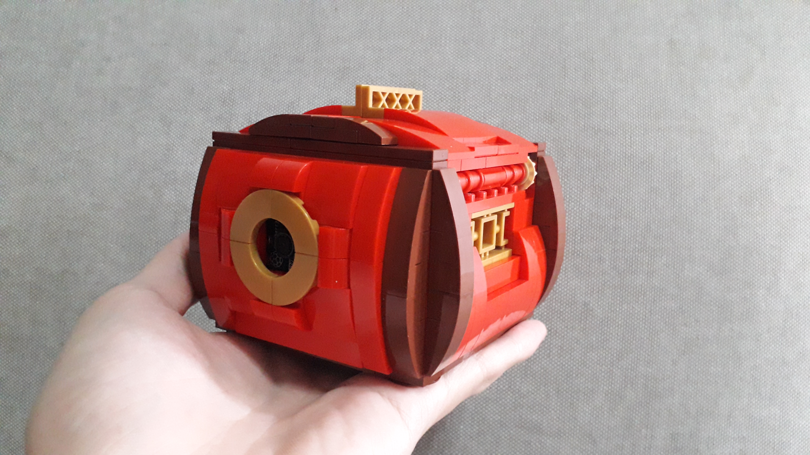
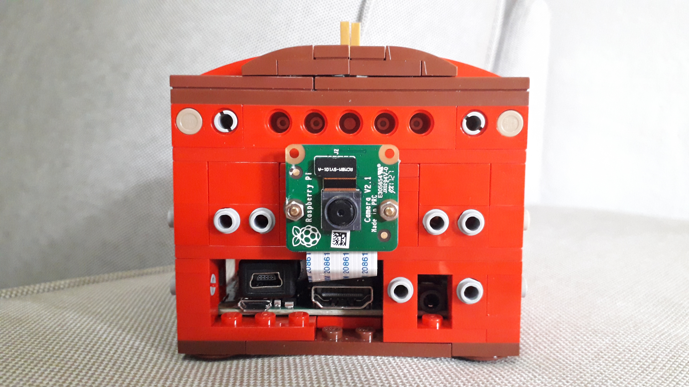

# LEGO Facial Recognition Box

## 1. Overview

I built a LEGO box around a Raspberry Pi 3A+, it's power source, a Pi camera and a servomotor. The box can be used to keep small valuable items (e.g. wedding ring), and will only open if it detects and recognizes faces that I've saved to the database.

<br>
*Presenting... the finished product.*

`Insert ring image here`

`Insert video here`

Of course, being built out of LEGO, a would-be thief could just dismantle the box... hehe! Still, this was a fun project and my first foray into combining LEGO with AI.

This project draws from the disciplines of mechanical, electronic and software engineering. The rest of this post explains how the box works and also some of the design decisions I've made. You may use the table of contents below to skip ahead if you'd like. Enjoy!

**Table of Contents**
- [Mechanical](#2-mechanical)
    - [Aesthetics](#21-aesthetics)
    - [Opening Mechanism](#22-opening-mechanism)
    - [Serviceability](#23-serviceability)
- [Electronics](#3-electronics)
    - [Component Selection](#31-component-selection)
    - [Wiring](#32-wiring)
    - [Servomotor Calibration](#33-servomotor-calibration)
- [Software](#4-software)
    - [Installation and Setup](#41-installation-and-setup)
    - [Running the Program](#42-running-the-program)
    - [Facial Recognition: Under the Hood](#43-facial-recognition-under-the-hood)
    - [Improving the Frame Rate](#44-improving-the-frame-rate)

## 2 Mechanical

### 2.1 Aesthetics

My goal was to design the box to be compact enough to fit in the palm of my hand, which was a challenge because of all the electronics required. The only external electronic component is the camera, which I mounted on one side of the box, and hid under the golden circular bricks. Sometimes, I'm reminded of Iron Man's chestplate when I see this...

<br>
*The box encapsulates all the electronics, yet manages to be small enough to fit in the palm of my hand.*

I wanted to build something Oriental-looking this time, and decided to go with red as the main colour, with a dash of gold and brown.  I added gold [Asian window screens](https://www.bricklink.com/v2/catalog/catalogitem.page?P=32932&idColor=115#T=C&C=115) on the other three sides of the box to accentuate the Oriental look. 

<br>
*The gold Asian window screens accentuate the Oriental look.*


### 2.2 Opening Mechanism

The main mechanical feature of this project is the opening and closing of the box. The objective was for a single servomotor to open and close both covers simultaneously. I tried different gear layouts and [four-bar linkages](https://hackaday.com/2017/03/29/marvelous-mechanisms-the-ubiquitous-four-bar-linkage/), and decided to go with the bevel gear mechanism shown in the animation below. Here, I've uncoupled the bevel gear from the servo, and manually rotated the shaft to illustrate how it works.

<br>
*Animation of the bevel gear opening mechanism.*

The advantages of this solution are:
- The servo and geartrain can be placed within space constraints.
- Minimal freeplay of covers. If freeplay were present, even if the covers were shut, you would be able to pry them open slightly - definitely undesirable for this project. To minimise freeplay in LEGO gears, the trick is to minimise the number of gears used, therefore reducing gear [backlash](https://en.wikipedia.org/wiki/Backlash_(engineering)).

### 2.3 Serviceability

To avoid having to dismantle the box in order to charge the battery, or to do troubleshooting, I added removable panels on 4 sides of the box. The panels serve mainly aesthetic purposes, and once removed, the ports of the Raspberry Pi and HAT are exposed as shown below:

| | |
| ---| ---|
| On/off switch on the battery HAT. ||
| USB Mini-B charging port, HDMI port, and camera. ||
| USB-A port.  ||

## 3 Electronics

### 3.1 Component Selection

What was the main factor in selecting electronic components? SPACE!!! I wanted everything to be contained within the box, while keeping the overall dimensions of the box as petite as possible. I was also adamant that the cross-section of the box should be a square instead of a rectangle (this would look weird). 

 <br>
*The electronics, contained within the LEGO box.*

<br>
*The 5 main electronic components.*

The design choices for these components are summarised in the table below:

| Component | Manufacturer/Model | Rationale for Choice|
|--- |--- |--- |
| Computer | Raspberry Pi 3 Model A+ | I used a Pi 3 Model B+ initially, but changed to Model A+ because of it's smaller size and square shape. It only has 512MB of RAM compared to 1GB in the B+, but it did not seem to adversely affect performance. |
| Servomotor | LOBOT LGS-01 Micro Anti-block Servo 270° Rotation | The main requirement was that the servo had to be able to inferface with LEGO bricks. Once I found one that could, I ordered it and designed the rest of the box around it. |
| Camera | Raspberry Pi Camera Module v2 | A straightforward choice, with the added bonus that it connects to the Pi via a compact ribbon cable. |
| Battery | [WaveShare HAT-LI-01](https://sg.cytron.io/waveshare/p-li-ion-battery-hat-for-raspberry-pi-5v-output-quick-charge?src=brand) (Li-Ion Battery HAT) + Generic 14500 Li-Ion rechargeable battery | This was tricky - I really wanted the box to be portable and thus it had to have its own power source. However, most powerbanks were too bulky to fit in the box. This component fit the bill nicely, with the only downside being having to recharge it every half an hour. |
| USB Micro-B to Mini-B adapter | Generic | Connects to the battery HAT, and juts out to the edge of the box. This allows the battery to be recharged by connecting a USB Mini-B cable, without having to dismantle the box to reach the HAT. |

### 3.2 Wiring

The wiring is pretty straightforward. First, attach the battery HAT on the Raspberry Pi. Next, connect the servo to 3 GPIO pins of the HAT (as the HAT has encapsulated the Pi's pins) following this [guide](https://tutorials-raspberrypi.com/raspberry-pi-servo-motor-control/). Lastly, connect the ribbon cable of the Pi camera to the Raspberry Pi's CSI port. That's it!

### 3.3 Servomotor Calibration

If you're not familiar with servomotors, here is an excellent [guide](https://medium.com/@rovai/pan-tilt-multi-servo-control-62f723d03f26) on how they work, and how to calibrate them, if required. I found some differences between the LOBOT servo specs and actual performance, and had to calibrate the servo.

I recorded the rotation angles for different duty cycles, and found that it varied linearly between the ranges in the table below.

| | Angle| Duty Cycle |
| --- | --- | --- |
| min | 0 deg | 2.5% |
| max | 300 deg | 12.5% |

Using linear interpolation:
```
(duty_cycle - 2.5)/(12.5 - 2.5) = (angle - 0)/(300 - 0)
```

The  equation above reduces to this, and now we have a direct relationship between the angle ('human language') and the duty cycle ('servo language'). This equation is used in [servomotor.py](src/utils/servomotor.py).
```
duty_cycle = angle/30.0 + 2.5
```

`To add calibration image`


## 4 Software


### 4.1 Installation and Setup

This section explains how to install the required libraries on the Raspberry Pi. Basic knowledge of using Raspberry Pi such as flashing the Raspbian OS is assumed. Do note that some of the following installation steps can be time consuming.

1. Follow Adrian Rosebrock's [guide](https://www.pyimagesearch.com/2017/09/04/raspbian-stretch-install-opencv-3-python-on-your-raspberry-pi/) to:
    - Install *pip*
    - Create a virtual environment (called *cv* in our case)
    - Install *numpy*
    - Build and install *OpenCV* from source (this will take a few hours)


2. Run the following commands in a terminal.
    ```
    workon <virtual env name>
    pip install dlib
    pip install face_recognition
    pip install PyYAML
    pip install "camerapi[array]"
    pip install RPi.GPIO
    ```
    - *dlib* contains the core facial recognition functionalities
    - *face_recognition* is built on top of *dlib*, and makes it simpler to use
    - *PyYAML* allows the reading of the *settings.yml* file
    - *"camerapi[array]"* allows the Raspberry Pi camera to be used 
    - *RPi.GPIO* allows the Raspberry Pi to control the servomotor using GPIO pins

3. Clone this repository.
    ```
    git clone https://github.com/leeping-ng/LEGO-Facial-Recognition-Box.git
    ```

### 4.2 Running the Program

If you've been connecting a keyboard, mouse and monitor to the Pi, it's time to disconnect them and remote into the Pi. After all, the box was designed to work as a standalone product (from the physical world point of view).  I'd recommend using [VNC Viewer](https://www.realvnc.com/en/connect/download/viewer/) to remote into the Pi instead of *ssh*. Although VNC will have more latency, it allows the videostream from the camera to be viewed remotely. 

1. In [settings.yml](settings.yml), configure the following settings and place the face images to the designated folder:
    - *faces_folder*: set the path of the directory where you will store the face images. Note that, for example,  putting an image named 'Harry Potter.jpg' in this folder is only the first step to grant access. 
    - *grant_access*: set a list of whitelisted names (whitelisted means you grant them access). Continuing on the previous example, the second step is to add 'Harry Potter' to this whitelist. 
    - *open_angle*: set the angle for the servomotor to rotate to in order to open the box.
    - *close_angle*: set the angle for the servomotor to rotate to in order to close the box.

2. To start the program:
    ```
    cd <directory containing LEGO-Facial-Recognition-Box>
    bash run.sh
    ```
    The program will keep running in a loop. If a whitelisted face is detected, the box opens and the program ends. (Do note the limited (~0.5h) battery life!)

`To add rpi screenshot`

3. To close the box:
    ```
    bash close.sh
    ```

You might want to take this a step further, and execute the *run.sh* script [on startup](https://raspberrypi.stackexchange.com/questions/15475/run-bash-script-on-startup). This way, once you switch on the Pi, the program starts running without requiring you to run any commands. However, you would still have to remote into the Pi to close the covers. 

### 4.3 Facial Recognition: Under the Hood

So, how does facial recognition work? Adam Geitgey, the creator of the [`face_recognition`](https://github.com/ageitgey/face_recognition) library which we're using, explained it nicely in this [article](https://medium.com/@ageitgey/machine-learning-is-fun-part-4-modern-face-recognition-with-deep-learning-c3cffc121d78).

From a high level, the facial recognition used in this repo can be broken down into 3 steps:
1. Face detection: Detect all the faces in a given image, and return the bounding box coordinates around each face. 
    - Adam's article explains a method called *HOG* or *Histogram of Oriented Gradients*, and this would be the default method if using `face_recognition.face_locations()`. 
    - However, to improve performance on a resource limited Raspberry Pi, this repo uses a faster but less accurate method called [*Haar Cascades*](http://www.willberger.org/cascade-haar-explained/). 
2. Encoding faces: For each detected face, convert the area of the face into a 128-dimension representative vector (a.k.a. embedding), using `face_recognition.face_encodings()`.
    - A deep neural network was trained by Davis King, the creator of [*dlib*](http://blog.dlib.net/2017/02/high-quality-face-recognition-with-deep.html), to be very good at creating embeddings from face images. `face_recognition` is built on top of *dlib*'s foundation.
    - The model is a [ResNet](https://arxiv.org/pdf/1512.03385.pdf) network with 29 convolutional layers, trained on a dataset of 3 million face images.    
3. Comparing embeddings: Compare the embedding of the detected face with the embeddings of the whitelisted faces in our database, using `face_recognition.compare_faces()`. If there's a match, grant access to the person.
    - A Support Vector Machine (SVM) classifier is used to compare the 128-dim vectors. This only took milliseconds on my Pi.

Adam's article included the step of *Posing and Projecting Faces* using *face landmark estimation* prior to encoding faces. This would help to deal with faces which are not looking directly at the camera. However, I've excluded this to reduce the computation load on the Pi.  

### 4.4 Improving the Frame Rate

I ran a series of experiments to assess the frame rate, averaging the results for about a minute each.

We can draw the following conclusions from the results below:
- The steps of detecting faces and encoding faces are similarly computationally expensive.
- We can't do much about the encoding face step, as we're using a pre-trained model, and it happens to be a pretty deep network at 29 convolutional layers.
- However, we could try to speed up the face detection step by using Haar Cascades instead of HOG.

| | With Face | No Face|
| --- | --- | --- |
| Detect face (HOG) | 570ms | 570ms |
| Encode face | 520ms | ~0ms |
| Frame Rate | 0.91 FPS | 1.70 FPS|

`To update Haar Cascades results`


## 5. Thanks

Adrian Rosebrock's [tutorial ](https://www.pyimagesearch.com/2018/06/25/raspberry-pi-face-recognition/) on deploying facial recognition software on Raspberry Pi was my starting point for this project. Thanks to Adrian's tutorial, I was able to tackle steps such as building and installing OpenCV from source on an Pi, without much difficulty.


