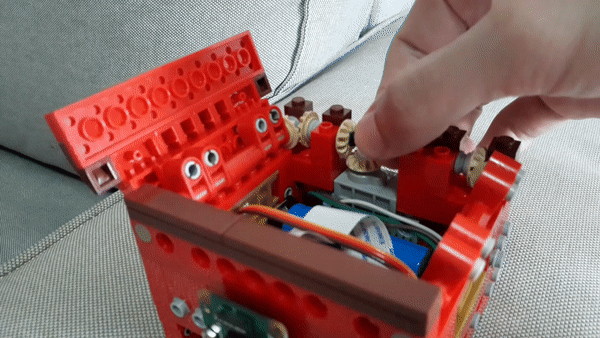

# LEGO Facial Recognition Box

### Testing GitHub Pages




### 1. Overview

I built a LEGO box around a Raspberry Pi 3A+, it's power source, a Pi camera and a servomotor. The box can be used to keep small valuable items (e.g. wedding ring), and will only open if it detects and recognizes faces that I've saved to the database.

`Insert video here`

Of course, being built out of LEGO, a would-be thief could just dismantle the box... hehe! Still, this was a fun project and my first foray into combining LEGO with AI.

This project draws from mechanical, electronic and software engineering. If you're interested in the mechanical (e.g. gearing) or electronic (e.g. component choice) details, you can check out this [blog post](https://leeping-ng.github.io/LEGO-Facial-Recognition-Box/). The rest of this readme will focus on the software aspects of this project.


### 2. Installation and Setup

This section explains how to install the required libraries on the Raspberry Pi. Patience is advised, as some of these steps can be time consuming.

1. Follow Adrian Rosebrock's [guide](https://www.pyimagesearch.com/2017/09/04/raspbian-stretch-install-opencv-3-python-on-your-raspberry-pi/) to:
    - Install *pip*
    - Create a virtual environment (called *cv* in our case)
    - Install *numpy*
    - Build and install *OpenCV* from source (this will take a few hours)


2. Run the following commands in a terminal.
    ```
    workon <virtual env name>
    pip install dlib
    pip install face_recognition
    pip install PyYAML
    pip install "camerapi[array]"
    pip install RPi.GPIO
    ```
    - *dlib* contains the core facial recognition functionalities
    - *face_recognition* is built on top of *dlib*, and makes it simpler to use
    - *PyYAML* allows the reading of the *settings.yml* file
    - *"camerapi[array]"* allows the Raspberry Pi camera to be used 
    - *RPi.GPIO* allows the Raspberry Pi to control the servomotor using GPIO pins