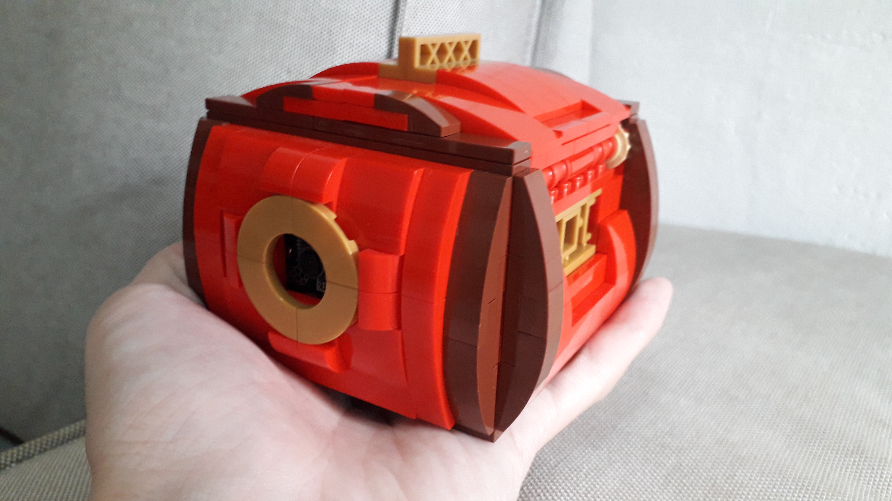
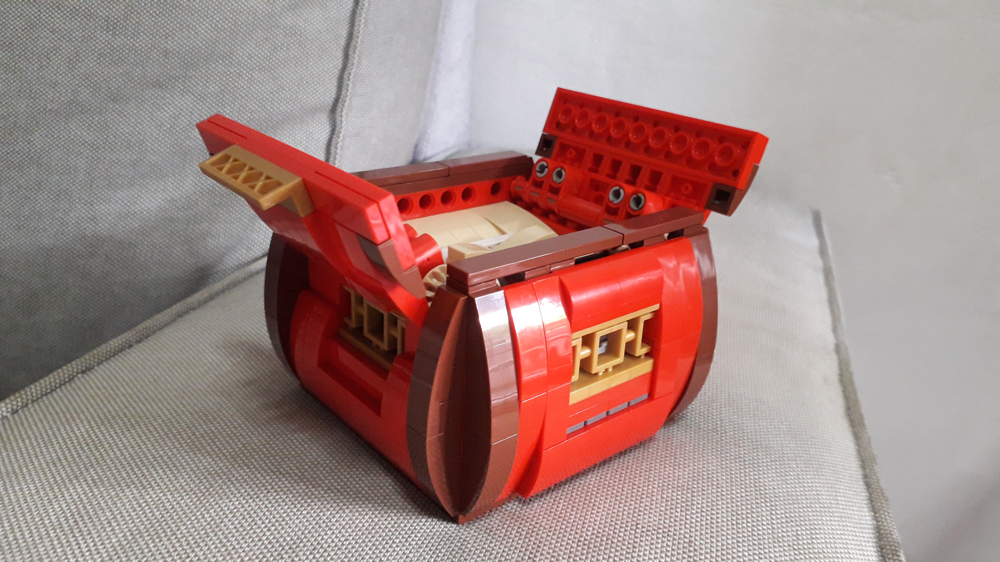
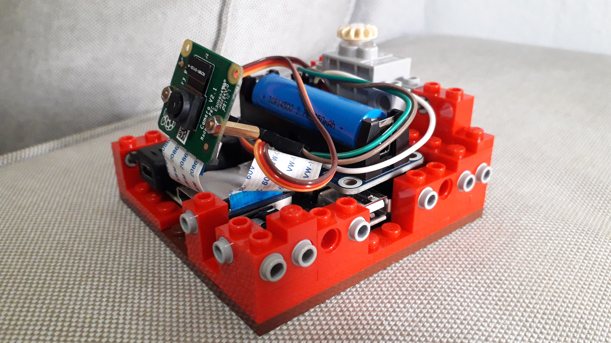

# LEGO Facial Recognition Box

### 1. Overview

I built a LEGO box around a Raspberry Pi 3A+, it's power source, a Pi camera and a servomotor. The box can be used to keep small valuable items (e.g. wedding ring), and will only open if it detects and recognizes faces that I've saved to the database.

<br>

`Insert video here`

Of course, being built out of LEGO, a would-be thief could just dismantle the box... hehe! Still, this was a fun project and my first foray into combining LEGO with AI.

This project draws from mechanical, electronic and software engineering. The rest of this post covers these 3 areas, explaining how it works and also some of the design decisions I've made. Enjoy!

### 2. Mechanical

#### 2.1 Aesthetics

I wanted to build something Oriental-looking this time, and decided to go with red as the main colour, with a dash of gold and brown. I added the gold [Asian window screens](https://www.bricklink.com/v2/catalog/catalogitem.page?P=32932&idColor=115#T=C&C=115) around to accentuate the Oriental look. I was also very strict on keeping the box small, and the final product was able to fit in the palm of hand.    

<br>
*The box is small enough to fit in the palm of my hand.*

<br>
*The gold Asian window screens accentuate the Oriental look.*

#### 2.2 Opening Mechanism

The main mechanical feature of this project is the opening and closing of the box. The objective was for a single servomotor to open and close both covers simultaneously. I tried different gear layouts and [four-bar linkages](https://hackaday.com/2017/03/29/marvelous-mechanisms-the-ubiquitous-four-bar-linkage/), and decided to go with the bevel gear mechanism shown in the animation below. Here, I've uncoupled the bevel gear from the servo, and manually rotated the shaft to illustrate how it works.


The advantages of this solution are:
- The servo and geartrain can be placed within space constraints.
- Minimal freeplay of covers. If freeplay were present, even if the covers were shut, you would be able to pry them open slightly - definitely undesirable for this project. To minimise freeplay in LEGO gears, the trick is to minimise the number of gears used, therefore reducing gear [backlash](https://en.wikipedia.org/wiki/Backlash_(engineering)).

#### 2.3 Serviceability

### 3. Electronics

#### 3.1 Component Selection

What was the main factor in selecting electronic components? SPACE!!! I wanted everything to be contained within the box, while keeping the overall dimensions of the box as petite as possible. I was also adamant that the cross-section of the box should be a square instead of a rectangle (this would look weird). 

 <br>
*The electronics, contained within the LEGO box.*


*The 5 main electronic components.*

The design choices for these components are summarised in the table below:

| Component | Manufacturer/Model | Rationale for Choice|
|-- |-- |-- |
| Computer | Raspberry Pi 3 Model A+ | I used a Pi 3 Model B+ initially, but changed to Model A+ because of it's smaller size and square shape. It only has 512MB of RAM compared to 1GB in the B+, but it did not seem to adversely affect performance. |
| Servomotor | LOBOT LGS-01 Micro Anti-block Servo 270° Rotation | The main requirement was that the servo had to be able to inferface with LEGO bricks. Once I found one that could, I ordered it and designed the rest of the box around it. |
| Camera | Raspberry Pi Camera Module v2 | A straightforward choice, with the added bonus that it connects to the Pi via a compact ribbon cable. |
| Battery | [WaveShare HAT-LI-01](https://sg.cytron.io/waveshare/p-li-ion-battery-hat-for-raspberry-pi-5v-output-quick-charge?src=brand) (Li-Ion Battery HAT) + Generic 14500 Li-Ion rechargeable battery | This was tricky - I really wanted the box to be portable and thus it had to have its own power source. However, most powerbanks were too bulky to fit in the box. This component fit the bill nicely, with the only downside being having to recharge it every half an hour. |
| USB Micro-B to Mini-B adapter | Generic | Connects to the battery HAT, and juts out to the edge of the box. This allows the battery to be recharged by connecting a USB Mini-B cable, without having to dismantle the box to reach the HAT. |

#### 3.2 Wiring

#### 3.3 Servomotor Calibration


### 4. Software


#### 4.1 Installation and Setup

This section explains how to install the required libraries on the Raspberry Pi. Patience is advised, as some of these steps can be time consuming.

1. Follow Adrian Rosebrock's [guide](https://www.pyimagesearch.com/2017/09/04/raspbian-stretch-install-opencv-3-python-on-your-raspberry-pi/) to:
    - Install *pip*
    - Create a virtual environment (called *cv* in our case)
    - Install *numpy*
    - Build and install *OpenCV* from source (this will take a few hours)


2. Run the following commands in a terminal.
    ```
    workon <virtual env name>
    pip install dlib
    pip install face_recognition
    pip install PyYAML
    pip install "camerapi[array]"
    pip install RPi.GPIO
    ```
    - *dlib* contains the core facial recognition functionalities
    - *face_recognition* is built on top of *dlib*, and makes it simpler to use
    - *PyYAML* allows the reading of the *settings.yml* file
    - *"camerapi[array]"* allows the Raspberry Pi camera to be used 
    - *RPi.GPIO* allows the Raspberry Pi to control the servomotor using GPIO pins
